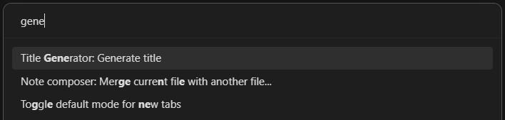
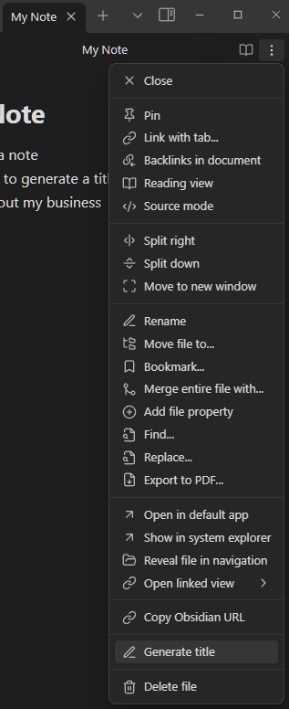
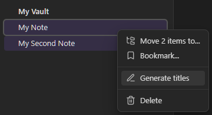

# Title Generator

Quickly and easily title your [Obsidian](https://obsidian.md) notes using [OpenAI's](https://openai.com/) GPT-3.5

Generate titles for one or multiple notes at a time.

Generating a title will set the note's title directly. Run multiple times for variations.

## Three ways to use

### Command Palette

If a note is active in either editing or reading mode, there will be an entry in the command palette: `Title Generator: Generate title`

### Editor Menu

If a note is active in either editing or reading mode, there will be an entry in the editor dropdown menu: `Generate title`

### File Menu

If you right click on a file name in the file menu there will be an entry in the contextual menu: `Generate title`.

With multiple files selected, right click on a file name and there will be an entry in the contextual menu: `Generate titles`

## Settings

You will need to create an [OpenAI API key](https://openai.com/product) and add it to this plugin's settings.